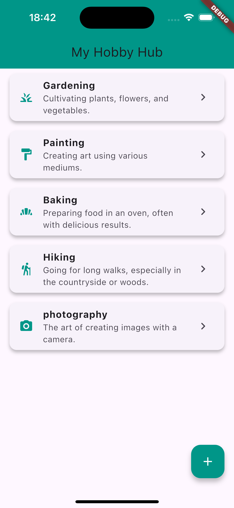
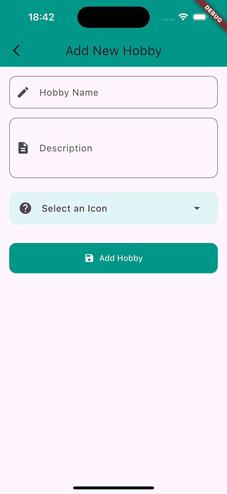
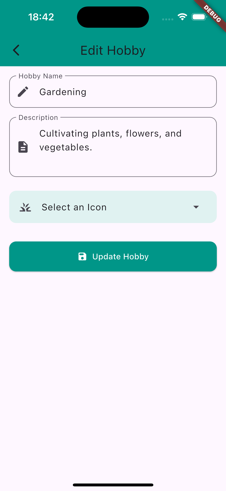
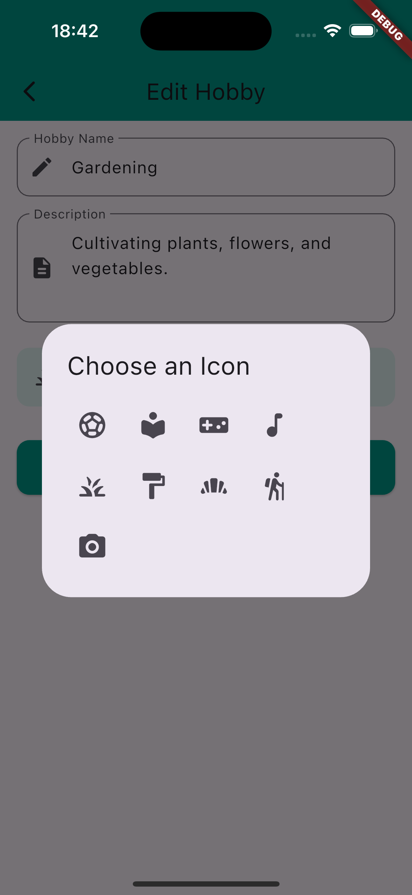
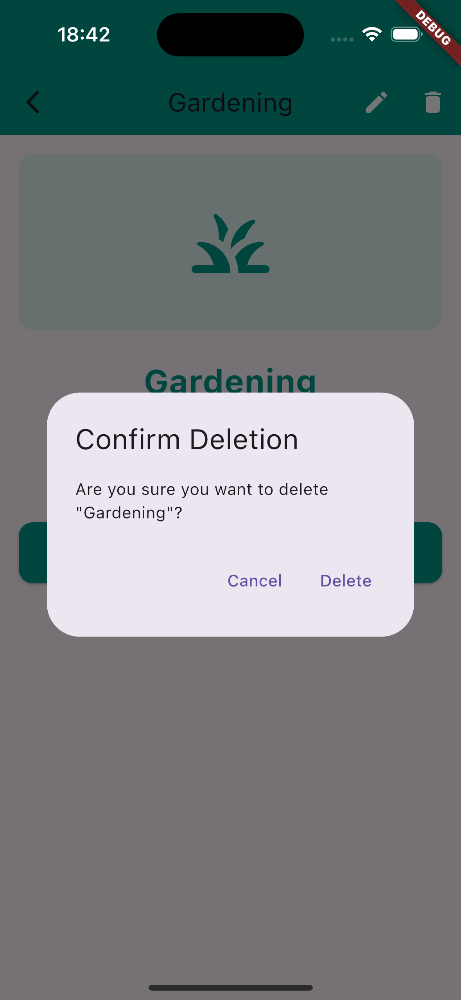

# 📱 Hobby Hub

**Hobby Hub** is a clean and simple Flutter application built to demonstrate a **professional and maintainable architecture**. It leverages modern tools such as **Riverpod**, **GoRouter**, and **encrypted Hive** storage to provide a secure, scalable, and responsive experience.

---

## ✨ Features

* **🔧 State Management:**
  Powered by [Riverpod](https://pub.dev/packages/flutter_riverpod) for a modern, reactive, and compile-time safe approach to managing app state.

* **🧭 Declarative Navigation:**
  Uses [GoRouter](https://pub.dev/packages/go_router) for simple and intuitive routing and deep linking.

* **🔐 Secure Data Persistence:**
  All hobby data is stored locally using an **encrypted Hive database** for fast and secure offline access.

* **🔑 Secure Key Storage:**
  The encryption key is safely stored using [flutter\_secure\_storage](https://pub.dev/packages/flutter_secure_storage).

* **🏗️ Clean Architecture:**
  The project follows a layered structure, separating **presentation**, **domain**, and **data** layers for better scalability and testability.

* **📝 Hobby Management:**
  Browse a list of hobbies, view detailed information, and add new hobbies via a user-friendly form.

---

## 🚀 Getting Started

Follow these steps to set up and run the project:

### 1. 📦 Add Dependencies

Ensure the following dependencies are included in your `pubspec.yaml`:

```yaml
dependencies:
  flutter:
    sdk: flutter
  flutter_riverpod: ^2.5.1
  go_router: ^14.0.0
  hive_flutter: ^1.1.0
  flutter_secure_storage: ^9.0.0
  path_provider: ^2.0.11

dev_dependencies:
  flutter_test:
    sdk: flutter
  hive_generator: ^2.0.1
  build_runner: ^2.1.11
```

### 2. ⚙️ Generate Hive Adapters

Hive models require code generation. Run the following command to generate the necessary files:

```bash
flutter pub run build_runner build
```

> 💡 Use `build_runner watch` during development for automatic regeneration:
>
> ```bash
> flutter pub run build_runner watch
> ```

### 3. ▶️ Run the App

Launch the app on a connected device or emulator:

```bash
flutter run
```

---

## 📁 Project Structure Overview

```
lib/
├── data/               # Local data sources, models, Hive setup
├── presentation/       # UI widgets, screens, and providers
├── app_router.dart     # App routing configuration with GoRouter
└── main.dart           # Entry point
```
--- 

## **Screenshots** 📸

Home | Add | Edit | Edit (Icon) | Deletion 
:---:|:---:|:---:|:---:|:---:|
 |  |  |  | 

## 📄 License
This project is licensed under the MIT License.
